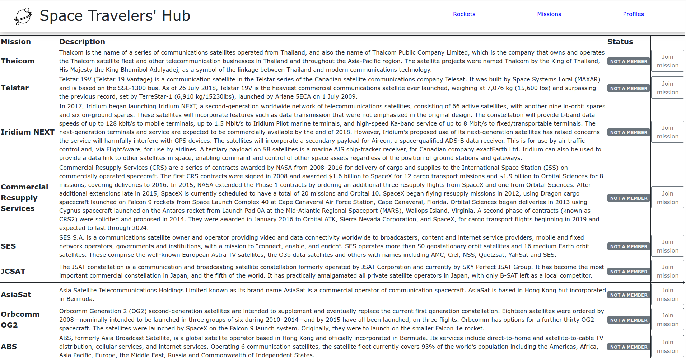

# Space Travelers


> This web application retrieves real live data from the SpaceX API. It provides commercial and scientific space travel services, by allowing users to book rockets and join selected space missions.
> The Rockets section displays a list of all available SpaceX rockets. Users can book each rocket by clicking the reservation button or cancel the previously made booking
> The Missions section displays a list of current missions along with their brief description and participation status. There is also a button next to each mission that allows users to join the selected mission or leave the mission the user joined earlier.
> The My Profile section displays all reserved rockets and space missions.

<!--  -->

## Live Demo

[Coming Soon on this address!](https://space-travelers-microverse-project.netlify.app/) Check back often to see our project growing, or
visit the [project's GitHub](https://github.com/iKuartz/space-travel) to look at its evolution commit by commit :)

## Built With

- Languages: HTML, CSS and JS
- Tools: React, Redux, Bootstrap, Webpack, NPM, Jest

## Getting Started

Clone

```sh
   git clone git@github.com:iKuartz/space-travel.git
```

Run

```sh
   cd space-travel
   npm install
   npm start
```
## Author

### 👤 Ivan Silva
- GitHub: [iKuartz](https://github.com/iKuartz)
- LinkedIn: [Ivan Barbosa da Silva](https://www.linkedin.com/in/ivan-silva-a47058b3/)

### 👤 Joaquin Garrido Lecca Zanetti
- GitHub: [@Kakalanp](https://github.com/Kakalanp)
- LinkedIn: [Joaquin Garrido Lecca Zanetti](https://www.linkedin.com/in/joaquín-garrido-lecca-zanetti-623583204)
- Twitter: [@LeccaJoaquin](https://twitter.com/LeccaJoaquin) 

## Contributing

Contributions, issues, and feature requests are welcome, feel free to check the [issues page](../../issues/).

## License

This project is [MIT](LICENSE) licensed.